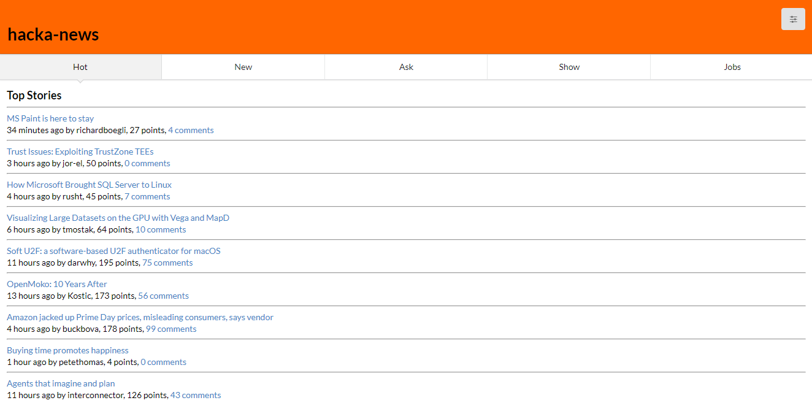

# hacka-news-web

**[Click here to view the live site](https://hacka-news.fly.dev/)**

A web interface for Hacker News that makes use of my [hacka-news](https://github.com/Coteh/hacka-news) node module. Features [Embedded JavaScript templates (ejs)](http://ejs.co/) and [Semantic UI](https://semantic-ui.com/).

## Features

- View top 10 headlines from five feed types (hot, new, ask, show, jobs)
- Change theme (regular, night, midnight, hacktoberfest)

## Installation

### Run installation

`yarn install`

### Download vendor scripts

`yarn dl-vendors`

## Running in Development

### Run the server

`node app.js`
(or `yarn start`)

### Run gulp script to build and deploy assets in development

`gulp dev`

## Running in Production

### Run gulp script to build the web app

`gulp`
(or `gulp prod`)

### Run the server directly

`node app.js`
(or `yarn start`)

### Run the server off a Docker container

#### Build Docker image
`docker build -t hn-web .`

#### Run container in detached mode
`docker run -d -p "8080:3000" hn-web`

## Known Limitations

- Does not implement all features that the [official Hacker News API](https://github.com/HackerNews/API) and hacka-news provide

## Future Additions

- Add comments view
- Add poll options view
- Add option to change number of posts to view
- Add mobile-friendly view
- Dynamically load news content
